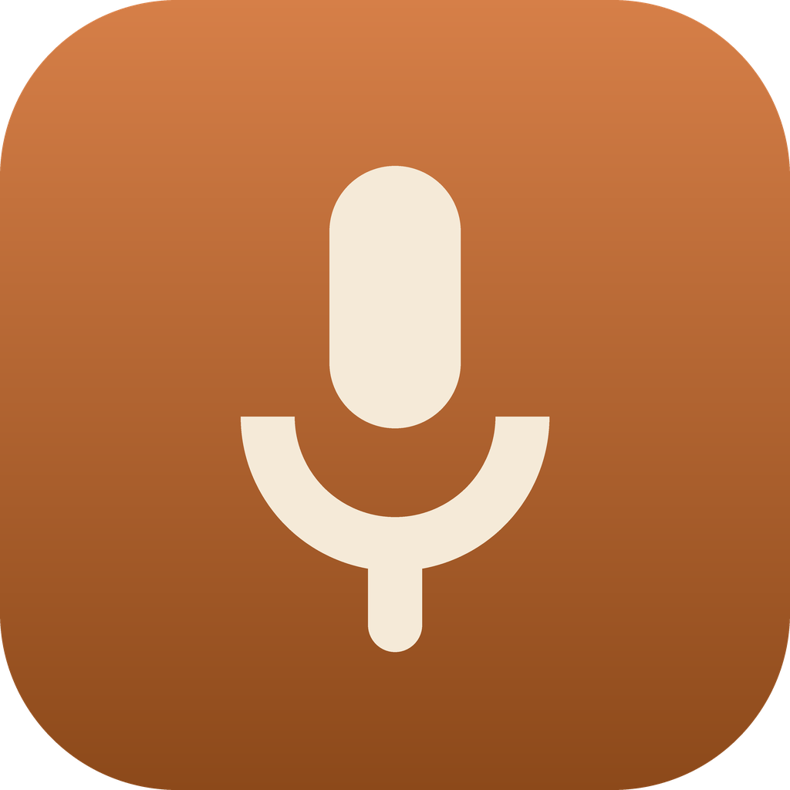

<div align="center">



# Amble

**A local-first meeting recorder and AI notepad for macOS.**

Records the call *and* your microphone, transcribes as you go, writes the meeting up when you
stop, and lets you chat with the result — with every model swappable, including local ones.

</div>

---

Press record. Amble captures **everything you hear** — the call, a browser tab, a video — **and
your voice**, transcribes it live, and turns it into structured notes when you stop: a summary,
numbered key points, and tickable action items with owners.

It's an open-source take on Granola, with one deliberate difference: **nothing is locked to a
vendor.** Transcription can run entirely on your Mac with whisper.cpp. Chat can run on Ollama,
LM Studio, OpenRouter, or OpenAI. Switching is two fields in Settings, and the rest of the app
can't tell the difference.

Built with [Tauri 2](https://tauri.app) — Rust backend, React frontend.

### What you get

- **Both sides of the conversation.** One ScreenCaptureKit stream captures system audio and your
  mic *separately*, so transcript lines are attributed to **You** vs **Them** without a
  diarization model. No BlackHole, no virtual audio device, no setup.
- **Structured write-ups.** Summary, key points, action items with owners — not a wall of prose.
- **Skills.** Reusable prompts that steer the model *during* the meeting, or run *after* it to
  draft the follow-up email, turn action items into tickets, and so on.
- **Chat with any meeting**, grounded in its transcript and your own notes.
- **A local MCP server**, so Claude Desktop and Claude Code can search and read your meetings.
- **Genuinely private.** Everything is a SQLite file on your Mac. Point it at local models and
  no audio or text ever leaves the machine.

---

## Requirements

- **macOS 15 or later** — ScreenCaptureKit gained separate microphone capture in 15.0.
- Apple Silicon recommended (whisper.cpp is dramatically faster with Metal).
- To build from source: [Rust](https://rustup.rs), [Node](https://nodejs.org) 20+, Xcode Command
  Line Tools.

## Install

### From a release

Download the `.dmg` from [Releases](../../releases) and drag Amble to `/Applications`.

Builds are **unsigned** (no Apple Developer certificate), so macOS will refuse the first launch.
Right-click the app → **Open** → **Open**, or:

```bash
xattr -dr com.apple.quarantine /Applications/Amble.app
```

### From source

```bash
git clone https://github.com/alnutile/vibe-code-granola
cd vibe-code-granola
npm install
npm run tauri dev
```

---

## Set up transcription — start here

**whisper.cpp is the recommended engine.** It runs entirely on your Mac, uses Metal on Apple
Silicon, costs nothing per minute, and in practice transcribes meetings excellently.

```bash
brew install whisper-cpp

# ~550MB. The best speed/accuracy balance for meetings on Apple Silicon.
curl -L -o ~/ggml-large-v3-turbo-q5_0.bin \
  https://huggingface.co/ggerganov/whisper.cpp/resolve/main/ggml-large-v3-turbo-q5_0.bin

whisper-server -m ~/ggml-large-v3-turbo-q5_0.bin --port 8080
```

Then in Amble: **Settings → Models → Voice to text → whisper.cpp**, endpoint
`http://127.0.0.1:8080`. Hit **Test connection**. That's it — no API key, nothing uploaded.

Leave `whisper-server` running while you record. To keep it running permanently, wrap it in a
`launchd` agent or a `tmux` session.

<details>
<summary><strong>Smaller / larger models</strong></summary>

| Model | Size | Notes |
|---|---|---|
| `ggml-base.en.bin` | 141MB | Fastest. Fine for clear solo audio. |
| `ggml-small.en.bin` | 465MB | Good middle ground. |
| `ggml-large-v3-turbo-q5_0.bin` | 547MB | **Recommended.** Near-large accuracy, turbo speed. |
| `ggml-large-v3.bin` | 2.9GB | Best accuracy, noticeably slower. |

All from [huggingface.co/ggerganov/whisper.cpp](https://huggingface.co/ggerganov/whisper.cpp).
</details>

<details>
<summary><strong>Other transcription options</strong></summary>

**speaches** (or any OpenAI-compatible server):

```bash
docker run -p 8000:8000 ghcr.io/speaches-ai/speaches:latest
```
Provider **Local, OpenAI-compatible**, endpoint `http://127.0.0.1:8000/v1`.

**OpenAI** — provider **OpenAI**, model `gpt-4o-mini-transcribe`, plus an API key. This uploads
your meeting audio.

> **LM Studio and Ollama cannot transcribe.** They serve chat and embeddings only — no
> `/audio/transcriptions` route — so a speech model loaded in them can't be used here, however
> promising it looks in their model list.
</details>

## Set up the chat model

Renders the notes, answers questions, and runs your skills. **Settings → Models → Chat &
transforms.**

| Provider | Endpoint | Notes |
|---|---|---|
| **Ollama** | `http://localhost:11434/v1` | Fully local. `ollama pull llama3.1` |
| **LM Studio** | `http://localhost:1234/v1` | Fully local, nice model browser |
| **OpenRouter** | `https://openrouter.ai/api/v1` | One key, any hosted model |
| **OpenAI** | `https://api.openai.com/v1` | |

API keys go to the **macOS Keychain** — never to a config file, never to this repo.

Pair whisper.cpp with Ollama and Amble is completely offline.

## Grant permission

macOS classifies "record what your speakers are playing" as a **screen-recording** capability, so
Amble needs it even though it never captures the picture.

1. **Settings → Recording → Screen Recording**, enable Amble
2. **Quit Amble completely and reopen it** — macOS won't apply the grant to a running process
3. Press record; macOS asks for the microphone the first time

---

## Recording a meeting

**New meeting** starts recording immediately. Write a line in the prompt box about what you want
out of it — that steers the live suggestions and the final write-up. Type in **My notes** as you
go; anything you write there is treated as higher-signal than the machine transcript.

Transcript lines appear every 15–30 seconds. Amble cuts audio at natural pauses rather than on a
fixed timer, so words don't get sliced in half.

Press **Stop & render** and it writes the meeting up, names it, and runs your after-skills.

## Skills

Reusable prompts, in **Skills & prompts**.

- **During the meeting** — folded into the prompt behind live suggestions. *"Track deliverables,
  placement, rates and deadlines. Separate what they asked for from what I agreed to."*
- **After the meeting** — run once against the transcript and the rendered note. *"Write a
  five-line follow-up email in my voice: what we decided, what I owe them, what I need back, by
  when."*

Enabled skills attach to every new meeting automatically; add or drop them per meeting from the
chips above the tabs. Results appear in an **After the meeting** block on the rendered note.

> A skill's "pushes to" target is recorded but **not delivered** — outbound MCP isn't wired up
> yet, so the output stays on the meeting.

## Connect Claude

Amble runs a local MCP server so Claude can search and read your meetings. Turn it on in
**Settings → Claude access**.

It binds to `127.0.0.1` only, requires a bearer token, and every tool is **read-only** — Claude
cannot delete a meeting or start a recording.

**Claude Desktop** — paste into `claude_desktop_config.json` (Settings → Developer → Edit
config). Desktop can't call an HTTP MCP server with custom headers directly, so this goes via the
[`mcp-remote`](https://www.npmjs.com/package/mcp-remote) bridge, which needs Node:

```json
{
  "mcpServers": {
    "amble": {
      "command": "npx",
      "args": [
        "-y",
        "mcp-remote",
        "http://127.0.0.1:8787/mcp",
        "--header",
        "Authorization:${AUTH_HEADER}"
      ],
      "env": {
        "AUTH_HEADER": "Bearer <your token from Settings>"
      }
    }
  }
}
```

The token lives in `env` rather than inline in `args` because Claude Desktop mangles spaces
inside an argument, which would corrupt `Bearer <token>`.

**Claude Code** — speaks HTTP natively, no bridge:

```bash
claude mcp add --transport http amble http://127.0.0.1:8787/mcp \
  --header "Authorization: Bearer <your token>"
```

Restart Claude afterwards. Amble must be running for Claude to reach it.

Tools: `search_meetings`, `list_meetings`, `get_meeting`, `get_transcript`, `list_folders`. Any of
them can be switched off in the same screen — a disabled tool becomes unreachable, not merely
unlisted.

---

## Your data

```
~/Library/Application Support/com.vibecode.granola/
├── config.json     preferences (no secrets)
├── granola.db      meetings, transcripts, notes, chat — SQLite
└── recordings/     per-chunk WAVs, only if you enable "keep audio files"
```

- **API keys live in the macOS Keychain.** The UI can ask *whether* a key is set; it can't read
  one back.
- **Audio is deleted after transcription** unless you opt in to keeping it.
- Nothing syncs anywhere. The only outbound traffic goes to the model provider you choose — and
  that can be `localhost`.

## How it works

```
ScreenCaptureKit ──┬── system audio ──┐
                   └── microphone ────┤
                                      ▼
                           cut at natural pauses
                                      │
                                      ▼
                    speech-to-text  (whisper.cpp | OpenAI | …)
                                      │
                                      ▼
                        SQLite  (transcript, notes, chat)
                                      │
                   ┌──────────────────┼──────────────────┐
                   ▼                  ▼                  ▼
            live suggestions      write-up            chat
                                      │
                        chat model  (Ollama | OpenRouter | …)
```

Three decisions worth knowing:

**System audio comes from ScreenCaptureKit, not a virtual device.** Amble asks for the smallest,
slowest video stream macOS will give it (2×2 at 1fps) and throws every frame away — the video is
only there because SCK has no audio-only mode.

**Mic and system audio stay separate all the way to the transcript**, which is where speaker
attribution comes from. You can turn this off to halve transcription calls.

**Chunks are cut at silence, not on a timer.** Fixed chunking slices words in half and Whisper
can't recover them. Silent chunks are dropped entirely, which also avoids the stock
hallucinations Whisper emits on silence ("Thanks for watching!").

## Development

```bash
npm run tauri dev                                  # run the app
cargo test --manifest-path src-tauri/Cargo.toml    # Rust tests
npx tsc --noEmit                                   # typecheck the frontend
npm run tauri build                                # .app + .dmg
```

`RUST_LOG=vibecode_granola_lib=debug npm run tauri dev` for the recording loop's internals.
See [CLAUDE.md](CLAUDE.md) for the architecture in more depth.

> Don't launch `target/debug/…` directly — a debug build loads the frontend from Vite on
> `localhost:1420`, so without the dev server you get a window that opens and renders nothing.

## Not done yet

- **Outbound MCP.** Connections are configured and stored, but nothing dials out — so a
  post-skill targeting "Linear · MCP" produces its output without filing anything.
- **Code signing / notarization.** Builds are unsigned; `entitlements.plist` is ready for when
  they aren't.
- **Nested folders.** The schema supports them; the UI is flat.
- Calendar integration, meeting auto-detection, audio playback alongside the transcript.

## License

MIT — see [LICENSE](LICENSE).
